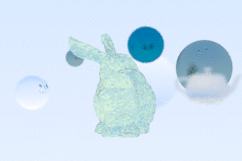
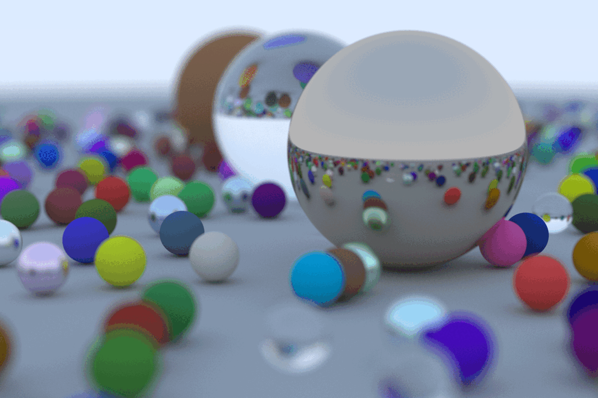
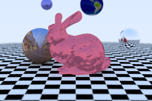
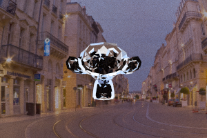
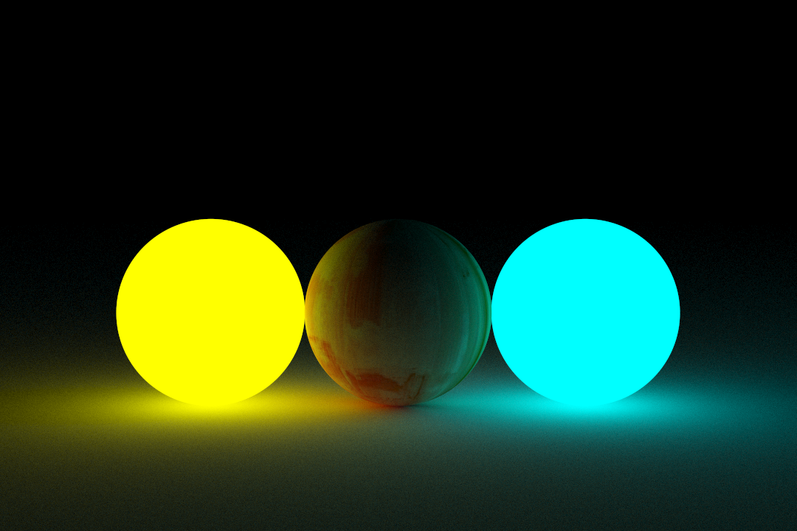

## Raytracer
Custom built Raytracer that includes rendering of .obj files, image textures, lights, cameras, normal determination, antialiasing, materials (metal, dielectric, lambert), and animation system. 

Based on Peter Shirley's raytracing series.

### How to run:
Navigate to the project folder at Raytracer_Renderer/part1/Textures_Lights_Animation <br />
Run using the commands:
1. ```python build.py```
2. ```./project``` 

## Video Demo: https://youtu.be/PULZVn62l_4

## Example Renders:

 <p align="center">
   
  </p>
  
   <p align="center">
   
  </p>
  
  <p align="center">
   
  </p>
  
  <p align="center">
   
  </p>
<p align="center">
   
  </p>
  
